<div align="center">

<samp>
<h1>📄 IndicDLP</h1>
<h2> A Foundational Dataset for Multi-Lingual and Multi-Domain Document Layout Parsing </h2>
</samp>


**_[ICDAR 2025 (ORAL)](https://www.icdar2025.com/)_**

| [](https://link_to_paper.com) | [](https://indicdlp.github.io/) | [](https://github.com/IndicDLP/IndicDLP/blob/main/LICENCE) |


</div>

---

## 📚 Table of Contents

1. [Overview](#-indicdlp-dataset)
2. [Annotation Schema](#-annotation-schema)
3. [Label Distribution](#-label-distribution)
4. [Dataset Format](#-directory-format)
5. [Download Dataset](#-download-dataset)
6. [Getting Started](#-getting-started)
7. [YOLOv10](#-yolov10)
8. [DocLayout-YOLO](#-doclayout-yolo)
9. [RoDLA](#-rodla)
10. [Visualizations](#-visualizations)
11. [Citation](#-citation)
12. [Contact](#-contact)

---

## 🧾 IndicDLP Dataset

**IndicDLP** is a large-scale, foundational dataset curated for advancing **multi-lingual** and **multi-domain** document layout parsing. Developed with the goal of enabling robust layout understanding across diverse Indic scripts and content types, IndicDLP brings together scale, linguistic diversity, and domain richness.

### 🌍 Key Features

- 📖 **Multi-Lingual Coverage**  
  121,198 high-resolution document images spanning **11 Indic languages** and **English**:  
  Assamese (8.6%), Bengali (7.9%), English (9.1%), Gujarati (8.6%), Hindi (8.7%), Kannada (8.5%), Malayalam (8.8%), Marathi (8.4%), Odia (8.2%), Punjabi (6.9%), Tamil (9.2%), Telugu (7.2%)

- 🗂 **Multi-Domain Representation**  
  Documents are sampled from **12 real-world domains**, ensuring coverage of diverse layout structures:  
  - Novels (11%)  
  - Textbooks (10.9%)  
  - Magazines (10.6%)  
  - Acts & Rules (10%)  
  - Research Papers (9.4%)  
  - Manuals (9.6%)  
  - Brochures (8.4%)  
  - Syllabi (6.8%)  
  - Question Papers (6.5%)  
  - Notices (5.4%)  
  - Forms (5.6%)  
  - Newspapers (5.7%)

- 🖼️ **Format & Quality**  
  - Source formats include **digitally-born documents** and **scanned documents**  
  - All images are annotated using rectangular bounding boxes

- ✍️ **Annotation Scale**  
  - A total of **1,856,241 layout annotations**  
  - Annotated using **Shoonya** – an open-source annotation tool built on Label Studio  
  - Covers **42 physical and logical region labels** across all document types

<!-- <p align="center">
  
  <br>
  <em>Figure 1: Samples from the IndicDLP dataset highlighting its diversity across docu-
ment formats, domains, languages, and temporal span. For improved differentiability,
segmentation masks are used instead of bounding boxes to highlight regions more ef-
fectively.</em>
</p> -->

<section class="section">
  <div class="container is-max-widescreen">

    <div class="columns is-multiline is-centered is-vcentered">

      <!-- Image A -->
      <div class="column is-one-third has-text-centered">
        <a href="https://raw.githubusercontent.com/Indic-Layout/IndicDLP/main/fig/images/ar_as_000253_0.png" target="_blank">
          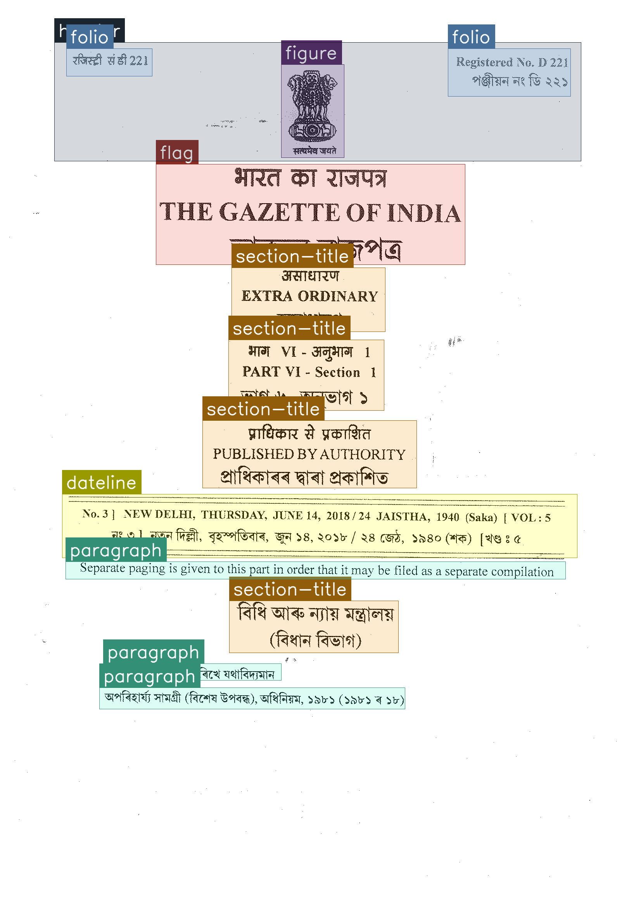
        </a>
        <p class="subtitle is-6">(A) Acts & Rules</p>
      </div>

      <!-- Image B -->
      <div class="column is-one-third has-text-centered">
        <a href="https://raw.githubusercontent.com/Indic-Layout/IndicDLP/main/fig/images/br_bn_000817_1.png" target="_blank">
          
        </a>
        <p class="subtitle is-6">(B) Brochures</p>
      </div>

      <!-- Image C -->
      <div class="column is-one-third has-text-centered">
        <a href="https://raw.githubusercontent.com/Indic-Layout/IndicDLP/main/fig/images/fm_bn_000220_0.png" target="_blank">
          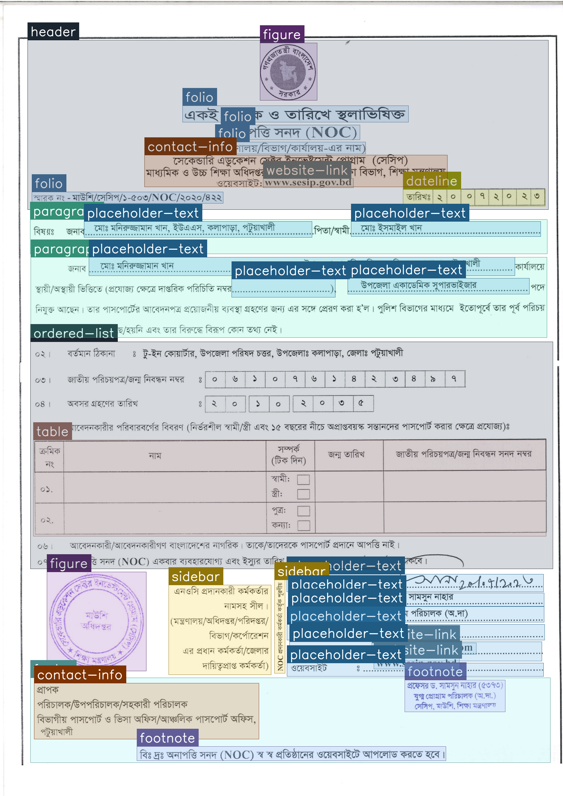
        </a>
        <p class="subtitle is-6">(C) Forms</p>
      </div>

      <!-- Image D -->
      <div class="column is-one-third has-text-centered">
        <a href="https://raw.githubusercontent.com/Indic-Layout/IndicDLP/main/fig/images/mg_or_000344_0.png" target="_blank">
          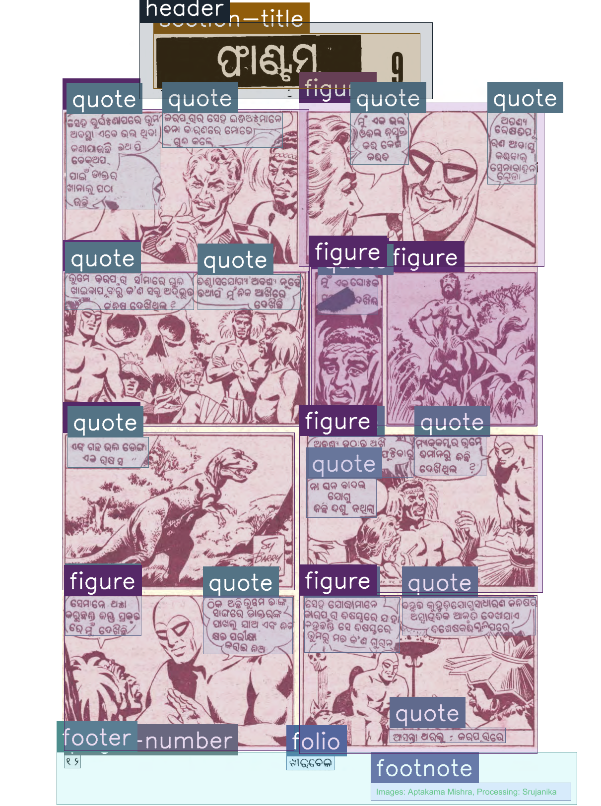
        </a>
        <p class="subtitle is-6">(D) Magazines</p>
      </div>

      <!-- Image E -->
      <div class="column is-one-third has-text-centered">
        <a href="https://raw.githubusercontent.com/Indic-Layout/IndicDLP/main/fig/images/mn_mr_000321_0.png" target="_blank">
          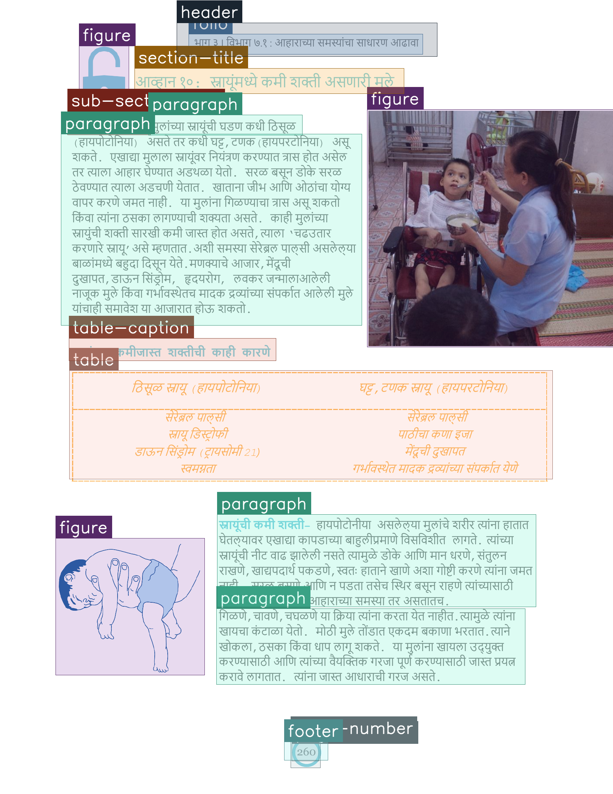
        </a>
        <p class="subtitle is-6">(E) Manuals</p>
      </div>

      <!-- Image F -->
      <div class="column is-one-third has-text-centered">
        <a href="https://raw.githubusercontent.com/Indic-Layout/IndicDLP/main/fig/images/np_bn_000047_0.png" target="_blank">
          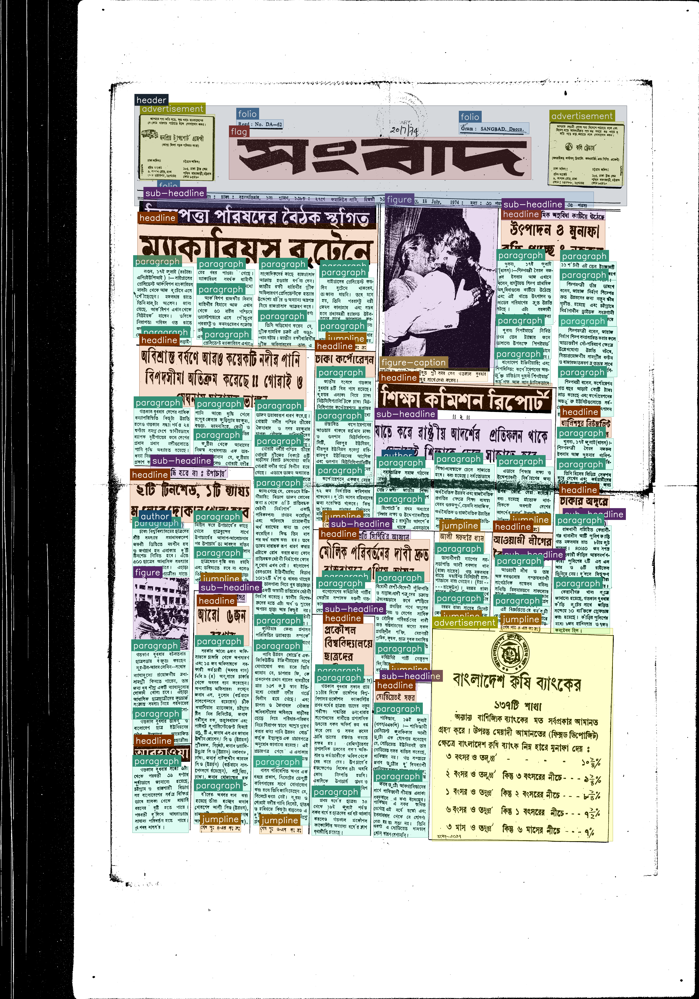
        </a>
        <p class="subtitle is-6">(F) Newspapers</p>
      </div>

      <!-- Image G -->
      <div class="column is-one-third has-text-centered">
        <a href="https://raw.githubusercontent.com/Indic-Layout/IndicDLP/main/fig/images/nt_pa_000046_0.png" target="_blank">
          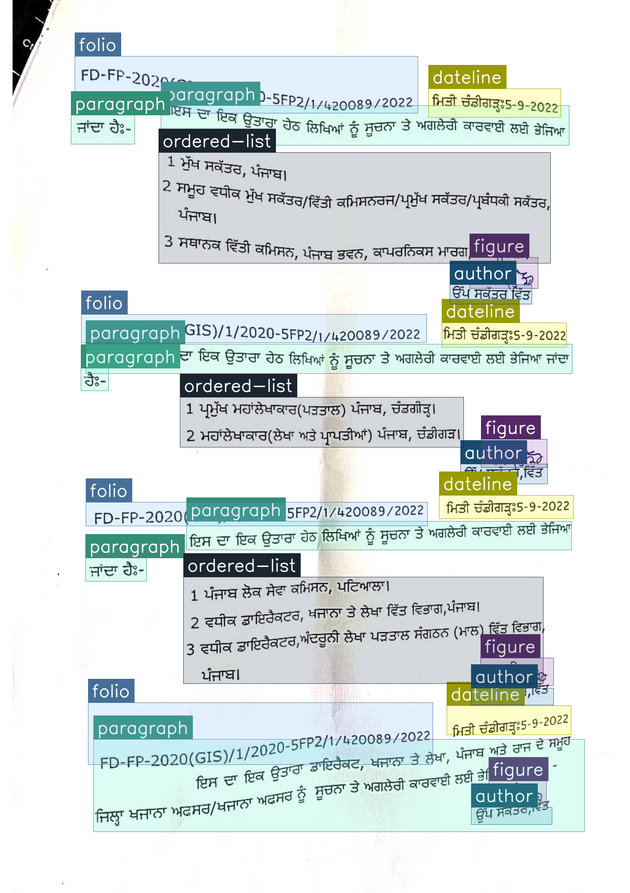
        </a>
        <p class="subtitle is-6">(G) Notices</p>
      </div>

      <!-- Image H -->
      <div class="column is-one-third has-text-centered">
        <a href="https://raw.githubusercontent.com/Indic-Layout/IndicDLP/main/fig/images/nv_pa_000112_0.png" target="_blank">
          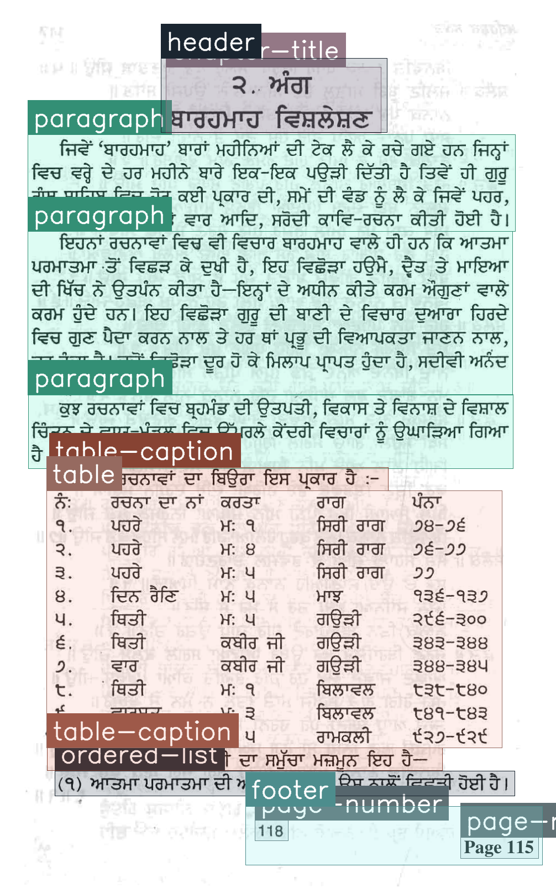
        </a>
        <p class="subtitle is-6">(H) Novels</p>
      </div>

      <!-- Image I -->
      <div class="column is-one-third has-text-centered">
        <a href="https://raw.githubusercontent.com/Indic-Layout/IndicDLP/main/fig/images/qp_bn_000287_1.png" target="_blank">
          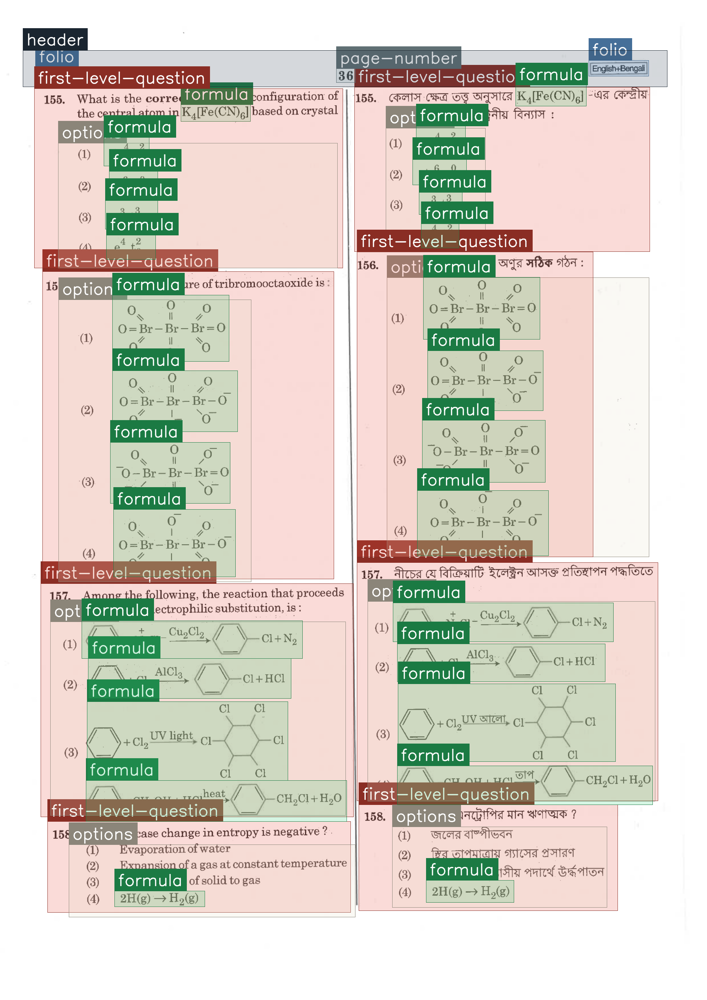
        </a>
        <p class="subtitle is-6">(I) Question Papers</p>
      </div>

      <!-- Image J -->
      <div class="column is-one-third has-text-centered">
        <a href="https://raw.githubusercontent.com/Indic-Layout/IndicDLP/main/fig/images/rp_en_001247_0.png" target="_blank">
          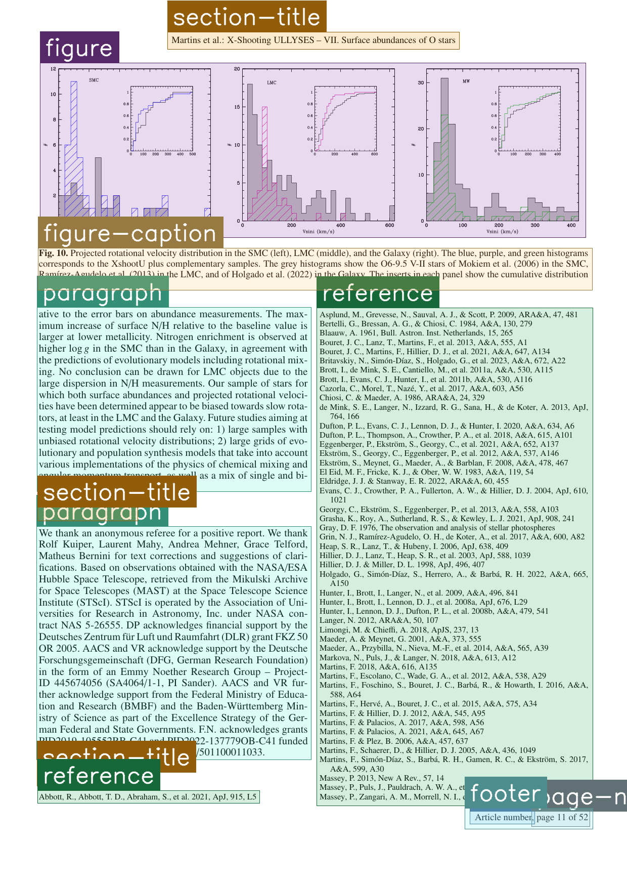
        </a>
        <p class="subtitle is-6">(J) Research Papers</p>
      </div>

      <!-- Image K -->
      <div class="column is-one-third has-text-centered">
        <a href="https://raw.githubusercontent.com/Indic-Layout/IndicDLP/main/fig/images/sy_ml_000721_0.png" target="_blank">
          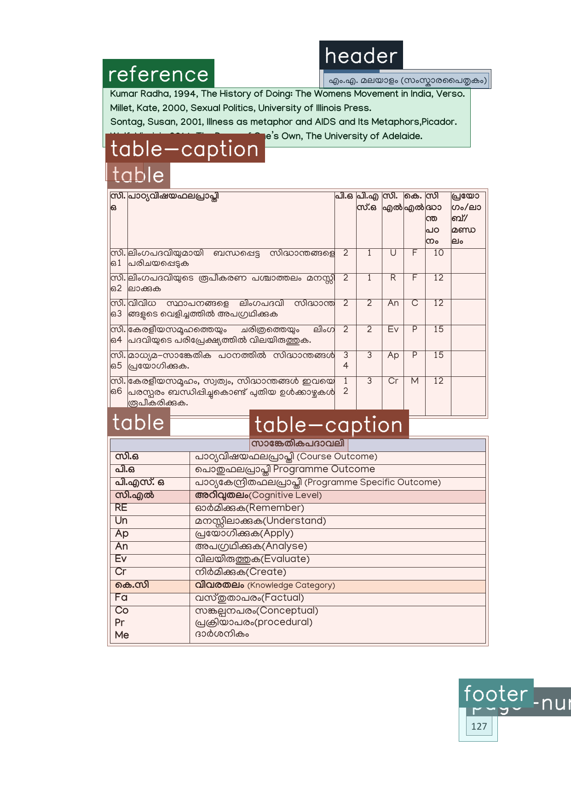
        </a>
        <p class="subtitle is-6">(K) Syllabi</p>
      </div>

      <!-- Image L -->
      <div class="column is-one-third has-text-centered">
        <a href="https://raw.githubusercontent.com/Indic-Layout/IndicDLP/main/fig/images/tb_ta_000689_0.png" target="_blank">
          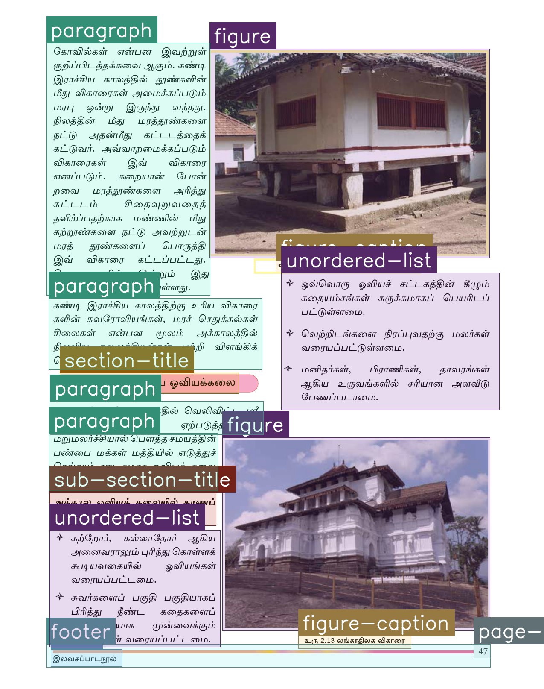
        </a>
        <p class="subtitle is-6">(L) Textbooks</p>
      </div>
    </div>

    <!-- Caption Below All Images -->
    <h2 class="subtitle has-text-centered mt-5">
      Samples from the IndicDLP dataset highlighting its diversity across document formats, domains, languages, and temporal span. For improved differentiability, segmentation masks are used instead of bounding boxes to highlight regions more effectively.
    </h2>

  </div>
</section>


---

## 🧷 Annotation Schema

To curate a robust and comprehensive set of region labels for IndicDLP, we conducted an extensive review of layout parsing benchmarks including **M6Doc**, **DocLayNet**, and **PubLayNet**. These references informed the balance between domain-independent and domain-specific structures in our label design.

### 🏷️ Final Label Set

Our final annotation schema includes **42 region labels** comprising:
- 🧩 **Domain-independent labels** like `paragraph`, `table`, `figure`, `title`
- 📰 **Domain-specific labels** like `jumpline` (newspapers), `placeholder` (forms)

### 🔁 Hierarchical & Overlapping Structures

We support fine-grained hierarchical labels such as:
- `section-title`  
- `sub-section-title`  
- `sub-sub-section-title`  

And overlapping list elements like:
- `ordered-list`, `sub-ordered-list`  
- `unordered-list`, `sub-unordered-list`  

These enable models to represent the document's semantic structure more effectively.

### ✍️ Annotation Guidelines

We trained a team of 50 annotators — 3 to 4 per language and 1 dedicated reviewer.  
A **150-page annotation guideline** was created, covering region definitions and multilingual examples across domains.

📄 [Annotation Guidelines PDF](guidelines/ANNOTATION_GUIDELINE_BY_CATEGORY.pdf)

---

## 📊 Label Distribution

To ensure fairness and usability, we divided the dataset into **train**, **validation**, and **test** sets in an 8:1:1 ratio. Label distributions are carefully balanced across all splits.

<p align="center">
  
  <br>
  <em>Table: Distribution of layout regions in IndicDLP, sorted in alphabetical order of
region label names.</em>
</p>

---


## ⬇️ Download Dataset

You can download the full IndicDLP dataset (images and annotations) using the link below:

📦 [Download IndicDLP Dataset](https://aikosh.indiaai.gov.in/home/datasets/details/indicdlp.html)

After downloading, extract and place the contents inside a directory named `dataset_root/`, as referenced in the scripts below.

---

## 📁 Directory Format

The dataset is structured as follows:

```
dataset_root/
├── data.yaml
├── images/
│   ├── train/
│   ├── test/
│   └── val/
└── labels/
    ├── train/
    ├── test/
    └── val/

```

- `data.yaml`: Contains class names and paths for training configuration (YOLO format)
- `images/`: Document images
- `labels/`: YOLO-format bounding box annotations

---


## ✅ Model Checkpoints

We provide three ready-to-use model checkpoints fine-tuned on the IndicDLP dataset to support robust document layout parsing across multiple Indic languages and domains.

| Model            | mAP<sub>[50:95]</sub> | Download Link |
|------------------|----------------------|----------------|
| **YOLOv10x**      | **57.7**             | [Download](https://zenodo.org/records/15881917/files/md2_PT_indicdlp_FT.pt?download=1) |
| **DocLayout-YOLO** | 54.5                | [Download](https://zenodo.org/records/15881917/files/doclayout_yolo_indicdlp.pt?download=1) |
| **RoDLA**         | 53.1                | [Download](https://zenodo.org/records/15881917/files/rodla_internimage_xl_indicdlp.pth?download=1) |

### 📥 Download with CLI

```bash
wget -O md2_PT_indicdlp_FT.pt "https://zenodo.org/records/15881917/files/md2_PT_indicdlp_FT.pt?download=1"
wget -O doclayout_yolo_indicdlp.pt "https://zenodo.org/records/15881917/files/doclayout_yolo_indicdlp.pt?download=1"
wget -O rodla_internimage_xl_indicdlp.pth "https://zenodo.org/records/15881917/files/rodla_internimage_xl_indicdlp.pth?download=1"

```

## 🛠 Getting Started

We provide code and instructions for using the IndicDLP dataset with the following models:

- [YOLOv10](#️-yolov10)
- [DocLayout-YOLO](#️-doclayout-yolo)
- [RoDLA](#️-rodla)

---

## ⚙️ YOLOv10

### Environment Setup

```bash
conda create -n indicdlp python=3.12
conda activate indicdlp
pip install -r requirements.txt
```

### Training

```bash
yolo detect train \
  data=dataset_root/data.yaml \
  model=yolov10x.yaml \
  device=0,1,2,3,4,5,6,7 \
  epochs=100 \
  imgsz=1024 \
  batch=64 \
  name=indicdlp_yolov10x \
  patience=5
```

### Evaluation

```bash
yolo detect val \
  model=/path/to/model_weights.pt \
  data=dataset_root/data.yaml \
  split=test
```

### Inference

```bash
yolo detect predict \
  model=/path/to/model_weights.pt \
  source=dataset_root/images/test/ \
  conf=0.2 \
  save=True
```

---

## ⚙️ DocLayout-YOLO

### Training

```bash
python train.py \
  --data data \
  --model m-doclayout \
  --epoch 100 \
  --image-size 1024 \
  --batch-size 64 \
  --project doclayout-yolo/indicdlp \
  --plot 1 \
  --optimizer SGD \
  --lr0 0.04 \
  --patience 5
```

### Evaluation

```bash
python val.py \
  --data data \
  --model /path/to/model.pt
```

### Inference

```bash
python predict.py \
  --model_path /path/to/model.pt \
  --image_path /path/to/image.jpg \
  --output_path /path/to/result.jpg
```

---

## ⚙️ RoDLA

### Environment Setup

```bash
conda create -n RoDLA python=3.8.10
conda activate RoDLA
cd RoDLA
```

### Install Dependencies

```bash
pip install torch==1.12.1+cu118 torchvision==0.13.1+cu118 -f https://download.pytorch.org/whl/torch_stable.html
pip install mmcv-full==1.6.0 -f https://download.openmmlab.com/mmcv/dist/cu118/torch2.0.1/index.html
pip install -r requirements.txt
```

### Install Auxiliary Packages

```bash
# Ocrodeg
git clone https://github.com/NVlabs/ocrodeg.git
cd ocrodeg
pip install -e .
cd ..

# Detectron2
git clone https://github.com/facebookresearch/detectron2.git
cd detectron2
pip install -e .
cd ..
```

### Compile CUDA Operators

```bash
cd RoDLA/model/ops_dcnv3
sh make.sh
```

### Training

```bash
cd RoDLA/model
bash dist_train.sh configs/indic/rodla_internimage_xl_indic.py 8
```

### Evaluation

```bash
python -u test.py configs/indic/rodla_internimage_xl_indic.py \
  checkpoint_dir/rodla_internimage_xl_indic.pth \
  --work-dir /path/to/workdir \
  --eval bbox \
  --cfg-options \
    data.test.ann_file=/path/to/val.json \
    data.test.img_prefix=/path/to/images/val
```

### Inference

```bash
python image_demo.py /path/to/image.jpg \
  configs/indic/rodla_internimage_xl_indic.py \
  checkpoint_dir/rodla_internimage_xl_indicdlp.pth \
  --out /path/to/outputdir
```

---

## 🔍 Visualizations

<p align="center">
  
  <br>
  <em>Figure 2: Qualitative analysis of YOLOv10x predictions on the IndicDLP test set. Each column corresponds to models trained on different datasets: DocLayNet, D4LA, M6Doc, and IndicDLP, followed by the Ground Truth. IndicDLP models show stronger performance on complex layouts and region types such as multicolumns and non-standard figures.</em>
</p>

---

## 🙏 Acknowledgements

We build upon the excellent work from the following repositories:

- [Ultralytics YOLOv10](https://github.com/ultralytics/ultralytics)
- [DocLayout-YOLO](https://github.com/opendatalab/DocLayout-YOLO)
- [RoDLA](https://github.com/yufanchen96/RoDLA)

We sincerely thank the authors for their open-source contributions.

---

## 📜 Citation

If you find this dataset or work useful, please consider citing:

```bibtex
@article{yourcitation2025, 
  title={IndicDLP: A Foundational Dataset for Multi-Lingual and Multi-Domain Document Layout Parsing}, 
  author={Oikantik Nath, Sahithi Kukkala, Mitesh Khapra, Ravi Kiran Sarvadevabhatla}, 
  booktitle={International Conference on Document Analysis and Recognition (ICDAR)}, 
  year={2025}
}
```

---

## 📬 Contact

For issues in running code/links not working, please reach out to [Sahithi Kukkala](mailto:sahithi.kukkala@research.iiit.ac.in) or [Oikantik Nath](mailto:oikantik@cse.iitm.ac.in) or mention in the **ISSUES** section.

For questions or collaborations, please reach out to [Dr. Ravi Kiran Sarvadevabhatla](mailto:ravi.kiran@iiit.ac.in).
