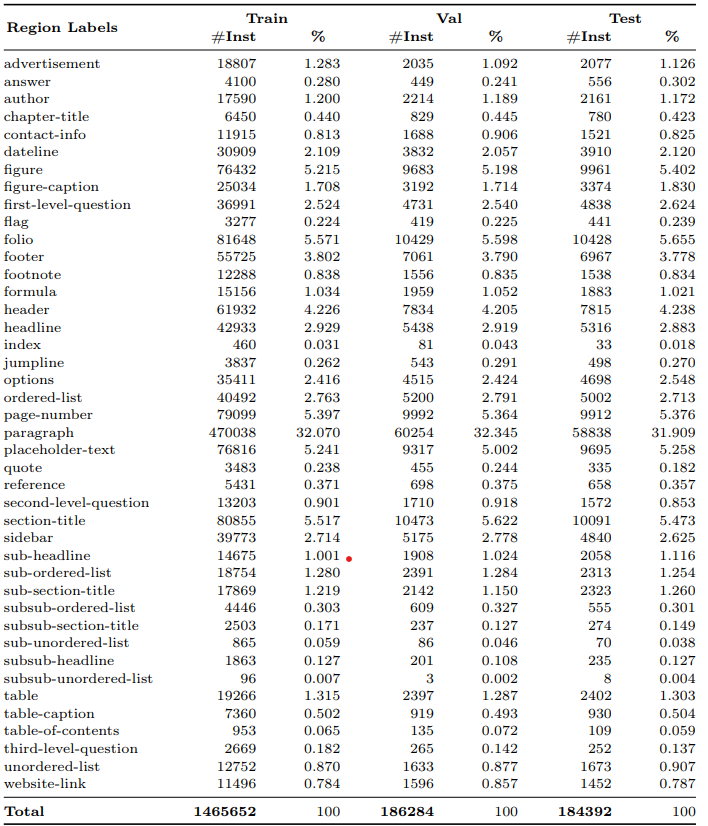

<div align="center">

<samp>
<h1>📄 IndicDLP</h1>
<h2> A Foundational Dataset for Multi-Lingual and Multi-Domain Document Layout Parsing </h2>
</samp>

**_[Published at ICDAR 2025](https://www.icdar2025.com/)_**

| **[ [```Paper```](https://link_to_paper.com) ]** | **[ [```Website```](https://indicdlp.github.io/) ]** |
|:-------------------:|:-------------------:|

<!-- <table>
    <tr>
        <td>
            <a href="https://your-teaser-video-link.com" target="_blank">
                
            </a>
        </td>
    </tr>
    <tr>
        <th><samp><a href="https://your-teaser-video-link.com" target="_blank">Teaser Video (Click to view)</a></samp></th>
    </tr>
</table> -->
</div>

---

## 📚 Table of Contents

1. [Overview](#-indicdlp-dataset)
2. [Annotation Schema](#-annotation-schema)
3. [Dataset Format](#-directory-format)
4. [Getting Started](#-getting-started)
5. [Model & Checkpoints](#-model--checkpoints)
6. [Evaluation](#-evaluation)
7. [Finetuning](#-finetuning)
8. [Visualizations](#-visualizations)
9. [Citation](#-citation)
10. [Contact](#-contact)

---

## 🧾 IndicDLP Dataset

**IndicDLP** is a large-scale, foundational dataset curated for advancing **multi-lingual** and **multi-domain** document layout parsing. Developed with the goal of enabling robust layout understanding across diverse Indic scripts and content types, IndicDLP brings together scale, linguistic diversity, and domain richness.

### 🌍 Key Features

- 📖 **Multi-Lingual Coverage**  
  121,198 high-resolution document images spanning **11 Indic languages** and **English**:  
  Assamese (8.6%), Bengali (7.9%), English (9.1%), Gujarati (8.6%), Hindi (8.7%), Kannada (8.5%), Malayalam (8.8%), Marathi (8.4%), Odia (8.2%), Punjabi (6.9%), Tamil (9.2%), Telugu (7.2%)

- 🗂 **Multi-Domain Representation**  
  Documents are sampled from **12 real-world domains**, ensuring coverage of diverse layout structures:  
  - Novels (11%)  
  - Textbooks (10.9%)  
  - Magazines (10.6%)  
  - Acts & Rules (10%)  
  - Research Papers (9.4%)  
  - Manuals (9.6%)  
  - Brochures (8.4%)  
  - Syllabi (6.8%)  
  - Question Papers (6.5%)  
  - Notices (5.4%)  
  - Forms (5.6%)  
  - Newspapers (5.7%)

- 🖼️ **Format & Quality**  
  - Source formats include **digitally-born documents** and **scanned documents**  
  - All images are annotated using rectangular bounding boxes

- ✍️ **Annotation Scale**  
  - A total of **1,856,241 layout annotations**  
  - Annotated using **Shoonya** – an open-source annotation tool built on Label Studio  
  - Covers **42 physical and logical region labels** across all document types

<p align="center">
  
  <br>
  <em>Figure 1: Samples from the IndicDLP dataset highlighting its diversity across docu-
ment formats, domains, languages, and temporal span. For improved differentiability,
segmentation masks are used instead of bounding boxes to highlight regions more ef-
fectively.</em>
</p>

---

## 🧷 Annotation Schema

To curate a robust and comprehensive set of region labels for IndicDLP, we conducted an extensive review of layout parsing benchmarks including **M6Doc**, **DocLayNet**, and **PubLayNet**. These references informed the balance between domain-independent and domain-specific structures in our label design.

### 🏷️ Final Label Set

Our final annotation schema includes **42 region labels** comprising:
- 🧩 **Domain-independent labels** like `paragraph`, `table`, `figure`, `title`
- 📰 **Domain-specific labels** like `jumpline` (newspapers), `placeholder` (forms)

### 🔁 Hierarchical & Overlapping Structures

We support fine-grained hierarchical labels such as:
- `section-title`  
- `sub-section-title`  
- `sub-sub-section-title`  

And overlapping list elements like:
- `ordered-list`, `sub-ordered-list`  
- `unordered-list`, `sub-unordered-list`  

These enable models to represent the document's semantic structure more effectively.

### ✍️ Annotation Guidelines

We trained a team of 50 annotators — 3 to 4 per language and 1 dedicated reviewer.  
A **150-page annotation guideline** was created, covering region definitions and multilingual examples across domains.

📄 [Annotation Guidelines PDF](guidelines/ANNOTATION_GUIDELINE_BY_CATEGORY.pdf)

---

## 📊 Label Distribution

To ensure fairness and usability, we divided the dataset into **train**, **validation**, and **test** sets in an 8:1:1 ratio. Label distributions are carefully balanced across all splits.

<p align="center">
  
  <br>
  <em>Table: Distribution of layout regions in IndicDLP, sorted in alphabetical order of
region label names.</em>
</p>

---

## 📁 Directory Format

The dataset is structured as follows:

```
dataset_root/
├── data.yaml
├── images/
│   ├── train/
│   ├── test/
│   └── val/
└── labels/
    ├── train/
    ├── test/
    └── val/

```

- `data.yaml`: Contains class names and paths for training configuration (YOLO format)
- `images/`: Document images
- `labels/`: YOLO-format bounding box annotations

---


## ⬇️ Download Dataset

You can download the full IndicDLP dataset (images and annotations) using the following link:

📦 [Download IndicDLP Dataset ](https://aikosh.indiaai.gov.in/home/datasets/details/indicdlp.html)

Once downloaded, place the contents inside a directory called `dataset_root/` to match the format shown above.


## ⚙️ Getting Started

We recommend using Python 3.10+ and a virtual environment.

### 1. Clone the repository

```bash
git clone https://github.com/IndicDLP/IndicDLP.git
cd IndicDLP

```
### 2. Create and activate environment

```bash
conda create -n indicdlp python=3.12
conda activate indicdlp

```
### 3. Install dependencies

```bash
pip install -r requirements.txt

```


---

## 🏋️ Training

To train a YOLOv10x model on the IndicDLP dataset, run:

```bash
yolo detect train \
  data=dataset_root/data.yaml \
  model=yolov10x.yaml \
  device=0,1,2,3,4,5,6,7 \
  epochs=100 \
  imgsz=1024 \
  batch=64 \
  name=indicdlp_yolov10x \
  patience: 5

```

```bash

yolo detect test \
  model=/path/to/modl_weights \
  data=dataset_root/data.yaml \
  split=test

```

```bash

yolo detect predict \
  model=/path/to/modl_weights \
  source=dataset_root/images/test/ \
  conf=0.2 \
  save=True

```


